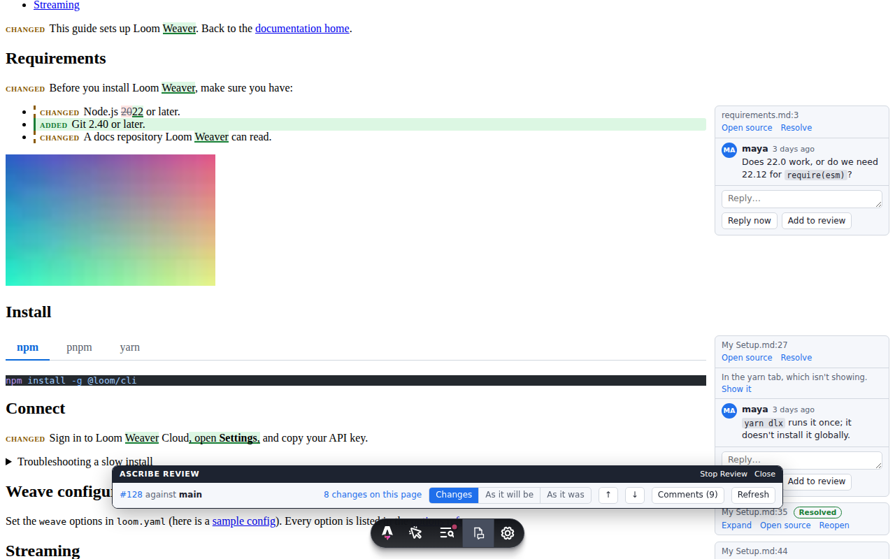

# Review

Ascribe shows a pull request the way readers will see it: each page it changes, rendered, with the changed blocks marked, and the pull request's review comments beside the blocks they're about. You read the change as pages instead of as a diff of Markdown files, comment where you're reading, and your comments land in the pull request like any other review. A change to a fragment shows on every page that includes it, a change to a phrase on every page that uses it, and reformatting shows on none.



You can review in three places, and they show the same changes and the same comments:

- the **page preview** in VS Code, which renders the page by itself and needs nothing but the extension;
- the **site preview**, the page in your real site, from `astro dev` with [`@ascribed/astro`](astro.md);
- the **report**, one HTML file that CI can attach to every pull request, for anyone who wants to read the change without a checkout.

## Review a pull request

You need a checkout of the pull request's branch, VS Code with the [Ascribe extension](editor.md#install), and, for comments, a GitHub account that can comment on the pull request.

### 1. Check out the branch

```sh
gh pr checkout 128
```

or `git fetch` and `git switch` to the branch. Review finds the pull request from the branch you're on, so the branch has to track the one on GitHub, as `gh pr checkout` and `git switch` both set it up to.

### 2. Start review

Open the folder in VS Code, open any page of the project, and run **Ascribe: Start Review** from the command palette. It's also the **Review: off** item in the status bar, and the review button in the page preview's title bar.

Review looks for the branch's pull request and asks what to compare with. Choose **The base of pull request #128**: it compares with the point where the branch left its base, as GitHub does. You can also pick the default branch, or type a branch, tag, or commit.

The first time, VS Code asks you to sign in to GitHub. Allow it to see comments. If you decline, review still marks the changes, and the preview offers **Sign in to see comments**, or **Use GitHub CLI** if you're signed in with `gh`.

### 3. Read the changed pages

**Ascribe: Changed Pages** (also the list button in the preview's title bar, and the status bar item) lists every page the pull request changes, with what changed on each. A page whose own file didn't change says what it changed through, such as `_fragments/requirements.md` or `ascribe.toml`. Choose one to open it and its page preview.

In the preview, changed blocks have a bar in the margin and a label: **Added**, **Changed** (with the changed words highlighted), **Removed** (shown where it was, struck through), and **Moved** (linked to where it came from). The header says how many changes the page has; the arrows step through them ("3 of 7 on this page"), and past the last one offer the next changed page. **Changes / As it will be / As it was** switches between the marks and the page without them, before and after. Click a mark's label to open its source lines.

### 4. Comment

The pull request's comments sit beside the blocks they're about, each thread with a line to its block when you point at either. In a narrow preview, a count on each block opens its threads.

- **To comment on a block,** point at it or move to it with the keyboard and choose **Comment**. Write the comment and choose **Add to review**. It's **unsent**: only you can see it until you submit.
- **To reply,** open the thread and write a reply. **Add to review** keeps it with your unsent comments. **Reply now** sends it at once, while you have no unsent comments.
- **To resolve a thread,** choose **Resolve**. It's resolved on GitHub at once. **Reopen** undoes it.

The same threads show on their lines in the source editor, where you can reply and comment too (see [Comments in the preview](editor.md#comments-in-the-preview)).

### 5. Submit

While you have unsent comments, a bar at the bottom of the preview counts them: "2 unsent comments. Only you can see them until you submit." **Submit review…** lists them, takes an optional summary, and sends them as a comment, an approval, or a request for changes. **Discard…**, in the same dialog, deletes them instead, after asking.

After you submit, the comments are on the pull request on GitHub, from you, like any review.

### Review in the site preview

The page preview shows the page alone. To review the page in your site's own layout, navigation, and styles, start the site's dev server on the same checkout:

```sh
gh auth login   # once
npx astro dev
```

Open the site in your browser and choose the **Ascribe review** app in Astro's dev toolbar, at the bottom of the page: opening it starts review. Its panel has the same controls as the page preview's header: the pull request and its base, the changes on the page, **Changes / As it will be / As it was**, next and previous change, **Comments**, and **Refresh**. Comments, replies, resolving, and submitting work as in the page preview, and go into the same review on GitHub. Close the panel to read the page; review stays on, on every page, until **Stop Review** or until `astro dev` stops.

In VS Code, **Ascribe: Open Site Preview** opens the page you're editing on the dev server, and the page preview's **Page | Site** switch shows the dev server's page in the preview panel. From a mark or a thread in either preview, **Open source** opens the file at its lines. [Review in the site preview](astro.md#review-in-the-site-preview) has the details.

## What you need for each part

| To | You need |
|---|---|
| See what changed, in either preview | `git` on the path, and a checkout of the branch |
| See and write comments in VS Code | A GitHub sign-in in VS Code, or the GitHub CLI (`gh`), signed in |
| See and write comments in the site preview | The GitHub CLI (`gh`) 2.0.0 or later, signed in, where `astro dev` runs |
| Read the report from CI | Nothing: it opens in any browser |

Nothing needs a hosted service, and nothing but GitHub stores comments.

## How comments map to the pull request

Every comment is an ordinary GitHub review comment. Ascribe keeps none of its own, so the pull request on GitHub is the record, and anyone can answer in GitHub's own interface.

- **A comment on a block is a review comment on its source file and lines,** at the pull request's latest commit. A block from a fragment is commented on in the fragment's file.
- **A fragment's thread shows on every page that includes it.** A comment made on one of those pages is on the fragment, so it shows on all of them.
- **GitHub takes review comments only on lines a pull request changes, and the few lines around them.** A comment on any other block, or on a page whose file isn't in the pull request (one that changed through a fragment or a phrase, say), goes in your review's summary instead, quoting the block and linking its lines. The comment box says so before you write. It reaches the pull request's conversation when you submit, and still shows beside its block in both previews, for you and for everyone else who reviews with Ascribe.
- **New comments stay unsent until you submit,** and nobody else sees them. GitHub's API calls this your pending review.
- **A reply can go at once, unless you have unsent comments.** While you do, GitHub adds every reply to your review, so **Reply now** is unavailable, and says why, until you submit or discard.
- **Resolving and reopening act at once,** on GitHub, and aren't part of your review.
- **A thread whose text changed since it was written** is labeled **Outdated**, beside the text that replaced it, with the text it was on a click away. A thread whose lines are gone from the page is **detached**: it's listed above the page with the text it was on. A thread on removed text shows on the removed block.

## The report in CI

`ascribe diff --format html` writes one HTML file showing every changed page rendered, with the same marks as the previews and **Show: Changes / As it will be / As it was**. It shows the changes only, not comments. The [command reference](cli.md#the-html-report) describes it in full.

```sh
ascribe diff --format html > review.html
```

The file holds everything it shows, images included, and makes no network requests, so it opens anywhere, with no checkout, no build, and no account. Nothing in a page runs: scripts, event handlers, and `javascript:` links in a page's HTML are left out, and the file's content security policy lets only its own script run, so a report from a pull request you don't trust yet is safe to open. The pages are Ascribe's bare render, the same as the page preview's, without your site's layout, navigation, or styles.

This GitHub Actions job writes the report on each pull request, uploads it, and links it from the run's summary, so a reviewer opens it from the pull request's checks. Change `--config docs` to your project's folder (the one with `ascribe.toml`), or drop it when that's the repository's root, and install `ascribe` however your other jobs do.

```yaml
name: Review

on:
  pull_request:

permissions:
  contents: read

jobs:
  report:
    runs-on: ubuntu-latest
    steps:
      - uses: actions/checkout@v7
        with:
          # The whole history, so `ascribe diff` finds where the branch left
          # its base. The default, one commit, isn't enough.
          fetch-depth: 0
      - uses: actions/setup-node@v7
        with:
          node-version: 24
      - run: npm install --global @ascribed/cli
      - name: Write the report
        run: >
          ascribe diff --config docs
          --base "origin/$GITHUB_BASE_REF" --format html > review.html
      - id: upload
        uses: actions/upload-artifact@v7
        with:
          name: review.html
          path: review.html
          # One file, not zipped, so it opens in the browser.
          archive: false
      - name: Link the report from the summary
        env:
          URL: ${{ steps.upload.outputs.artifact-url }}
        run: |
          {
            echo "### Review report"
            echo
            ascribe diff --config docs --base "origin/$GITHUB_BASE_REF" | sed 's/^/    /'
            echo
            echo "[Open the review report]($URL)"
          } >> "$GITHUB_STEP_SUMMARY"
```

- **History.** `ascribe diff` compares with the merge base of the pull request's base branch and its head, as the pull request itself does, so the checkout needs enough history to find it: `fetch-depth: 0`. With less, `ascribe diff` stops and says so; `--base-exact` compares with the base branch's tip instead, which also lists changes made on the base branch since the pull request branched.
- **The base.** `--base "origin/$GITHUB_BASE_REF"` names the pull request's base branch. Without it, `ascribe diff` uses the repository's default branch.
- **Opening it.** `archive: false` uploads the file as it is instead of in a zip, so the summary's link opens it in the browser. The link needs read access to the repository, like the rest of the run.
- **Large changes.** A report renders the first 300 changed pages and lists the rest by name, and leaves out images over 1 MB, so it stays small enough to open.

This repository runs the same job on `examples/quill`, in [`.github/workflows/review.yml`](../.github/workflows/review.yml).

## When something's missing

- **No pull request found.** Review shows the changes against the base you picked, and no comments. Review finds the pull request whose head is the branch you're on, in the repository the branch is pushed to (or in a remote named `upstream`, for a fork). Check that the branch is pushed and tracks its remote branch (`git status` names it), that the pull request is open, and then choose **Ascribe: Refresh Comments**, or **Refresh** in the site preview.
- **Not signed in.** The page preview says "Showing changes only. Comments need GitHub." with **Sign in to see comments** and, when `gh` is signed in, **Use GitHub CLI**. The site preview says to run `gh auth login` (with `--hostname` for GitHub Enterprise Server), then **Refresh**.
- **Comments are off in the site preview.** When `astro dev` listens on the network (`--host`), or your Vite config lets other pages talk to the dev server (`server.cors: true`, `server.allowedHosts: true`, or `legacy.skipWebSocketTokenCheck`), the panel shows the changes only and names the setting. Anyone who could reach the dev server could otherwise comment as you.
- **Nothing is marked in the site preview.** The marks are placed by the `data-ascribe-source` attribute on each block. If your layout or a component rebuilds the content without it, the panel says the blocks carry no source anchors, and lists the page's changes and threads instead, each with **Open source**. A route that isn't an Ascribe page says so, and lists the changed pages.
- **The project has errors.** Review still compares the pages, but a page with an error can render oddly, and that oddity isn't the change. The page preview says how many errors the project has, with **Show problems**; the site preview, the HTML report, and `ascribe diff` (on standard error) say so too, and `ascribe check` lists them.
- **A thread is detached.** Its lines are no longer on the page: the text was deleted, the block moved to another page, or the thread is on a whole file. It's listed above the page with the text it was on. To reply to it or resolve it, open the pull request on GitHub: its number in the header is a link.
- **Your checkout is behind or ahead of the pull request.** Comments are placed on the pull request's latest commit. Behind, some comments may be on lines you don't have yet, and the page preview offers **Pull**. Ahead, with commits you haven't pushed, you can comment only on lines that are on GitHub: a block that changed locally says to push first, and the page preview offers **Push**. In VS Code, a block with unsaved changes says to save the file first.
- **Review won't start.** Review needs `git` on the path, and the project in a git repository. A base that doesn't exist, or a shallow clone without the merge base, stops it with a message that says which. In VS Code, the project's language server must be running: open one of its pages first.

## Privacy and security

- **Review is the only time Ascribe contacts GitHub,** and only once you start it. Nothing runs `git` for a comparison, and nothing talks to GitHub, before you choose **Start Review** in VS Code or open the **Ascribe review** app in the site preview. The `ascribe` binary itself never uses the network: it runs `git` on your machine.
- **Ascribe stores no token.** In VS Code, comments go through VS Code's own GitHub sign-in, which asks for the `repo` permission that posting review comments needs, or through `gh`. In the site preview, the dev server runs `gh` on your machine. Neither keeps a token of its own.
- **No token reaches a page.** The previews draw the comments but never talk to GitHub: in VS Code the extension makes every request, and in the site preview the dev server does, over Vite's own connection, which only pages from the dev server can open.
- **Pages and comments can't run code.** The previews and the report take scripts, event handlers, and `javascript:` links out of a page's HTML. Comment bodies are rendered from a safe subset of Markdown: no raw HTML, and an image shows as a link, so nothing loads until you click.
- **What's sent to GitHub** is what you write, and the file and lines it's on. A comment held in the summary also quotes the block's text and carries a hidden marker naming its block, `<!-- ascribe:anchor guides/install.md:12-14 build=site -->`, so that the previews can put it back on the block.
