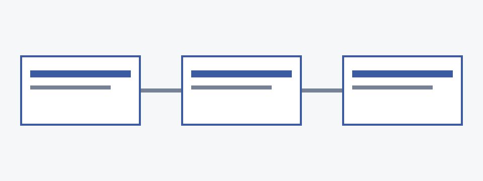

This guide takes about ten minutes. At the end, your app reads a feature flag from {product}, and you can turn the flag on and off without redeploying.

## Before you begin
@id: before-you-begin

@include: _fragments/prerequisites.md

## Install the CLI
@id: install-cli

@variant {platform=macos}:
```shell
brew install lantern-cli
```
@variant {platform=linux}:
```shell
curl -fsSL https://get.lantern.example | sh
```
@variant {platform=windows}:
```powershell
winget install Lantern.CLI
```
@end

Check the install:

```shell phrases=true
lantern --version
# lantern {version}
```

## Connect the CLI
@id: connect

@variant {edition=cloud}:
Sign in with your {cloud} account. The CLI opens a browser window to finish signing in.

```shell
lantern login
```

@variant {edition=self-hosted}:
Point the CLI at your server and sign in with a token from **Settings → Access tokens**.

```shell
lantern login --server https://lantern.internal.example.com --token "$LANTERN_TOKEN"
```
@end

## Create your first flag
@id: first-flag

@steps
1. Create a project for your app:

   ```shell
   lantern projects create checkout
   ```

2. Create a boolean flag. New flags are off everywhere.

   ```shell
   lantern flags create new-checkout --project checkout --type boolean
   ```

3. Read the flag in your app with the SDK:

   ```typescript
   import { Lantern } from "@lantern/sdk";

   const lantern = new Lantern({ key: process.env.LANTERN_SDK_KEY });
   if (await lantern.enabled("new-checkout", { userId: user.id })) {
     renderNewCheckout();
   }
   ```

4. Turn the flag on for yourself and reload the app:

   ```shell
   lantern flags enable new-checkout --user you@example.com
   ```

   @note
   Flag changes reach the SDK within a few seconds. The SDK keeps the last values it saw, so your app keeps working if it can't reach {product}.

{width=720}

## Next steps
@id: next-steps

- Learn the flag types and naming rules in [](guides/create-flags.md).
- Roll the flag out to more users with [](guides/rollouts.md).
