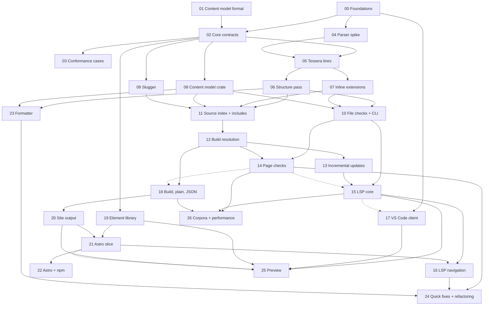

# Implementation phases

This directory breaks [PLAN.md](../PLAN.md) into discrete phases of work, each sized for one AI agent working in one session or a short series of sessions. [SPEC.md](../../SPEC.md) is the source of truth for behavior; the plan is the source of truth for architecture; [contracts](../contracts/) are the source of truth for interfaces shared between phases; each phase file is the source of truth for its own scope.

## How to work a phase

1. Read this README in full, then your phase file, then every document your phase file lists under **Read first**.
2. Check your phase's dependencies:
   - **Start after:** every phase listed must be complete (its handoff notes filled in) before you begin. If one isn't, stop and say so.
   - **Finish after:** you may start before these are complete, but you can't mark your phase done until they are and your acceptance criteria pass against their work. Typically these are phases your final integration tests need.
3. Work on a branch named `phase/NN-short-name`. Touch only the files your phase owns (see [Ownership](#ownership)), except where your phase file says otherwise.
4. Meet every item under **Acceptance criteria**. Run the listed commands and confirm they pass.
5. Fill in the **Handoff notes** section at the bottom of your phase file: what you built, the public interfaces later phases use, decisions you made, and anything left open.

## Conventions

### Rust

- Stable toolchain, pinned in `rust-toolchain.toml`. Edition 2024.
- `cargo fmt --all` and `cargo clippy --workspace --all-targets -- -D warnings` must pass.
- Libraries return errors with `thiserror` types and never panic on user input. No `unwrap()` or `expect()` outside tests, except on invariants you document in a comment.
- Snapshot tests use `insta`. Review new snapshots; never accept them blindly.
- Public items in library crates have doc comments.

### JavaScript and TypeScript

- pnpm workspaces. Node 22 LTS. TypeScript in strict mode.
- Format with Prettier and lint with ESLint, using the shared config from phase 00.

### Git

- One branch per phase. Small, reviewable commits.
- Never push to `main`, publish packages, create releases, or change repository settings. Those need a human.

### When the spec is unclear

SPEC.md is normative, but it will have gaps. When you hit one:

1. Don't guess silently. Add an entry to [`project-docs/questions.md`](../questions.md) (created in phase 00) with the section, the ambiguity, the options, and your proposed resolution.
2. Implement the most conservative option, meaning the one that reports an error or keeps content rather than dropping it.
3. Mark the code with a `// SPEC-QUESTION(Qn)` comment pointing at the entry, and tag any conformance case that depends on it `provisional`.
4. Keep going. Don't edit SPEC.md; a human resolves questions and updates the spec.

### Contracts

Phase 02 writes the contracts that parallel phases share: core types, the diagnostics registry, the element contract, and the asset, output-layout, and site-render contracts. Once phase 02 is complete, a contract changes only through a question in `questions.md` approved by a human, and the change lists every phase it affects. Don't work around a contract; raise it.

### Conformance cases and skips

The conformance harness reports every case as passed, failed, or skipped. A case may be skipped only for a reason recorded in `tests/conformance/SKIPS.toml` (for example, "adapter for tag `resolve` not yet implemented"). A phase's acceptance criteria require that the cases for its area run and pass, and that it removes the skip entries for them.

### Definition of done

- Acceptance criteria met, with the commands passing locally and in CI.
- New public interfaces documented, in doc comments or the crate's README.
- Skip entries for the phase's own conformance cases removed.
- Handoff notes filled in.

## Phases

| # | Phase | Track | Start after | Finish after |
|---|---|---|---|---|
| 00 | [Foundations](00-foundations.md) | Setup | — | — |
| 01 | [Content model format](01-content-model-format.md) | Model | — | — |
| 02 | [Core contracts](02-core-contracts.md) | Setup | 00, 01 | — |
| 03 | [Conformance cases](03-conformance-cases.md) | Tests | 00, 01, 02 | — |
| 04 | [Parser spike](04-parser-spike.md) | Parser | 00 | — |
| 05 | [Tessera lines and syntax tree](05-tessera-lines.md) | Parser | 02, 04 | 03 |
| 06 | [Structure pass](06-structure-pass.md) | Parser | 05 | 03 |
| 07 | [Inline extensions](07-inline-extensions.md) | Parser | 05 | 03 |
| 08 | [Content model crate](08-content-model-crate.md) | Model | 01, 02 | — |
| 09 | [Slugger](09-slugger.md) | Resolve | 02 | — |
| 10 | [File-level checks and `tessera check`](10-file-checks-and-cli.md) | Check | 06, 07, 08 | 03 |
| 11 | [Source index and includes](11-source-index-and-includes.md) | Resolve | 06, 07, 08, 09 | 03 |
| 12 | [Build resolution and linking](12-build-resolution.md) | Resolve | 11 | 03 |
| 13 | [Incremental updates](13-incremental-updates.md) | Resolve | 12 | — |
| 14 | [Page-level checks](14-page-checks.md) | Check | 10, 12 | 03 |
| 15 | [Language server core](15-lsp-core.md) | Editor | 10, 13 | 14 |
| 16 | [Language server navigation](16-lsp-navigation.md) | Editor | 15, 21 | — |
| 17 | [VS Code extension client](17-vscode-client.md) | Editor | 00 | 15 |
| 18 | [`tessera build`, plain markdown, and JSON](18-build-plain-json.md) | Output | 12 | 14 |
| 19 | [Element library](19-element-library.md) | Web | 02 | — |
| 20 | [Site output and Astro profile](20-site-output.md) | Output | 18 | — |
| 21 | [Astro end-to-end slice](21-astro-slice.md) | Web | 19, 20 | — |
| 22 | [Astro integration and npm distribution](22-astro-and-npm.md) | Web | 21 | — |
| 23 | [Formatter](23-formatter.md) | Format | 06, 08 | — |
| 24 | [Quick fixes and refactoring](24-quick-fixes-and-refactoring.md) | Editor | 14, 16, 23 | — |
| 25 | [Preview](25-preview.md) | Editor | 15, 17, 19, 20 | 21 |
| 26 | [Corpora and performance](26-corpora-and-performance.md) | Tests | 14, 15, 18 | — |
| 27 | [Release](27-release.md) | Release | all | — |

## Dependency graph

Solid arrows are "start after"; dashed arrows are "finish after".

Every phase that runs conformance cases in its acceptance criteria also finishes after 03; those edges are left out of the graph for readability.

## Parallel schedule

Phases in the same wave can start at the same time, in separate branches or worktrees. A phase can start as soon as its own "start after" phases are complete; the waves only show the earliest point.

| Wave | Can start | Notes |
|---|---|---|
| A | 00, 01 | 01 is design documentation, no code |
| B | 02, 04, 17 | 17 builds the client and grammar against a stub server until 15 exists |
| C | 03, 05, 08, 09, 19 | All build on the phase 02 contracts |
| D | 06, 07 | Separate modules of `tessera-syntax`; see [Ownership](#ownership) |
| E | 10, 11, 23 | Three separate crates |
| F | 12 | |
| G | 13, 14, 18 | 18 can't finish until 14 does |
| H | 15, 20 | 15 can't finish until 14 does |
| I | 21, 26 | 21 is the end-to-end check that gates the full editor experience |
| J | 16, 22, 25 | 25 can't finish until 21 does |
| K | 24 | |
| L | 27 | |

The longest chain of dependencies is 00 → 02 → 05 → 06 → 11 → 12 → 18 → 20 → 21 → 16 → 24 → 27. Whether it's also the critical path depends on how long each phase takes, which these documents don't estimate.

## Ownership

To keep parallel phases from colliding, each phase owns specific paths. Changing a path another phase owns means raising it through that phase's handoff notes or a question.

| Path | Owner | Shared with |
|---|---|---|
| `Cargo.toml`, CI workflows, root configs | 00 | Any phase may add a workspace member or CI job |
| `crates/tessera-core` | 02 (types and traits) | 05 adds `attributes.rs`; 08 adds `availability.rs` |
| `project-docs/contracts/`, `packages/elements/CONTRACT.md`, `tests/conformance/diagnostics.toml`, `tests/render/` | 02 | Changes only through the contract process; 20 and 21 add render fixtures |
| `crates/comrak-tessera` | 04 (fork, block changes) | 07 (inline changes) |
| `crates/tessera-syntax` | 05 (tree, Tessera lines) | 06 owns `src/structure/`; 07 owns `src/inline/` |
| `crates/tessera-model` | 08 | |
| `crates/tessera-check` | 10 | 14 owns `src/page/` |
| `crates/tessera-resolve` | 11 | 09 owns `src/slug/`; 12 owns `src/build/`; 13 owns `src/incremental/` |
| `crates/tessera-emit` | 18 | 20 owns `src/site/`, `src/render/`, and `src/zod/` |
| `crates/tessera-fmt` | 23 | |
| `crates/tessera-lsp` | 15 | 16, 24, and 25 add feature modules |
| `crates/tessera-cli` | 10 (command structure, `check`) | 15 adds `lsp`, 18 adds `build`, 23 adds `fmt`, each in its own module |
| `packages/elements` | 19 | |
| `packages/astro`, `examples/astro-site` | 21 | 22 extends them |
| `packages/cli` | 22 | |
| `packages/vscode` | 17 | 24 and 25 add features |
| `tests/conformance` | 03 | Every phase adds cases for what it builds |
| `examples/quill` | 03 | |
| `project-docs/content-model.md` | 01 | |

## Human checkpoints

These need a person, not an agent:

- **After 01:** review the `tessera.toml` format.
- **After 02:** review the contracts before parallel implementation begins.
- **After 04:** confirm the go or no-go decision on the comrak fork.
- **Before 22:** confirm that the npm scope `@tessera` and the package names are available, or choose new ones. Every package name in these phases assumes the scope.
- **Throughout:** resolve entries in `project-docs/questions.md`, and approve contract changes.
- **27:** all publishing.

## Release gates

Phase 27 can't finish until all of these hold:

- **No unintentional skips.** Every conformance case runs. `SKIPS.toml` is empty, or every remaining entry has a human-approved reason.
- **Diagnostic parity.** For every build of every example project, `tessera check`, `tessera build`, and the language server report the same diagnostics. The parity tests from phases 15 and 18 pass on every platform.
- **End to end.** The Astro slice's tests (phase 21) pass on every platform in CI.
- **Performance.** The targets in phase 26 are met, or each miss is accepted by a human.
